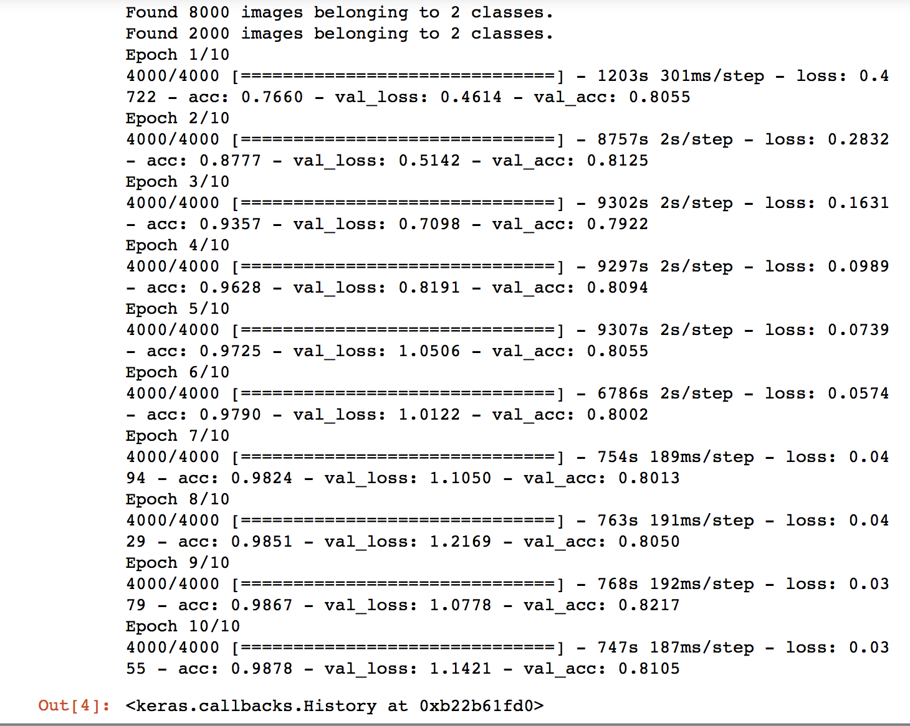

# Cats-Vs-Dogs-Image-Classifier

Overview
==========
A project that trains a convolutional nerual network that can decipher whether there is a dog or cat in an image.

Dependencies 
==========
* Numpy (http://www.numpy.org/)
* Keras ```pip3 install keras```

Dataset
=========
https://www.kaggle.com/rahul897/catsdogs

Convolutional Network
==========
The network take an input of 64 by 64 resolution images. The images are filter by 32 filters to search for patterns in the pixels. The filters sequences undergo pool which reduces the size of the sequence while keeping the most reconized patterns. There is a second layer where is process repeats. The seqeunces are flattened and the fully connected layer with a single output. The network is compiled and trained. 


Results
=========
The model was trained for 10 epochs with 4000 steps per epoch. To obtain a higher accuracy the model should be trained on 10 epochs with 8000 steps per epoch but I did not have access to a GPU that would complete the training in suficient time.

The model obtained a accuracy score of 0.9878 and loss of 0.0355. However the validation accuracy is 0.8105 and validation loss is 1.14. A higher number of epochs and steps per epoch would be needed to better predict new images.




Acknowledgment
===========
This project was completed as an assignment in Udemy Deep Learning Course

